# MandelaAir Quality Prediction App

MandelaAir is a Streamlit application for estimating air-quality conditions across Nigeria. It combines historical pollution data with location and time features to predict AQI and pollutant values for a selected state and coordinate pair.

## Project goal

The system estimates pollutant and AQI-related values using features such as:

- longitude
- latitude
- month
- day
- hour
- state label

The model predicts values such as:

- AQI
- CO
- NO
- NO2
- O3
- SO2
- PM2.5
- PM10
- NH3

## System architecture

```mermaid
flowchart LR
    A[Air pollution dataset + state coordinates] --> B[Data preprocessing]
    B --> C[Feature engineering]
    C --> D[Gradient boosting regression model]
    D --> E[Saved model + scaler artifacts]
    E --> F[Streamlit app]
    F --> G[User input: state, coordinates, date]
    G --> H[Predicted AQI and pollutant values]
    H --> I[Folium map + results table]
```



## Repository structure

- [Air_Quality.py](Air_Quality.py): main Streamlit landing page
- [pages/0_Multi_AQI_Regressor.py](pages/0_Multi_AQI_Regressor.py): prediction UI and model inference
- [air_quality_02_data_extraction.ipynb](air_quality_02_data_extraction.ipynb): data preparation and extraction notebook
- [air_quality_02_model_GBR.ipynb](air_quality_02_model_GBR.ipynb): model training and experimentation notebook
- [air_pollution_api_final_new_07122023.csv](air_pollution_api_final_new_07122023.csv): pollution dataset used for training and prediction
- [nigerian_states.csv](nigerian_states.csv): state coordinates used for location lookup
- [mgbr_1_model.joblib](mgbr_1_model.joblib): trained multi-output gradient boosting model
- [scaler_mgbr.pkl](scaler_mgbr.pkl): scaler used to normalize inputs before prediction
- [requirements.txt](requirements.txt): Python dependency list
- [utils.py](utils.py): currently not used for the main app logic

## Environment setup

This project is built for Python 3 and uses several scientific and data-visualization libraries.

```bash
python -m venv .venv
source .venv/bin/activate  # macOS/Linux
# or
.venv\Scripts\activate     # Windows

pip install -r requirements.txt
```

## Run the app

Important: the actual prediction flow is implemented in the page file, not only in the landing page.

To start the app:

```bash
streamlit run Air_Quality.py
```

This launches the main Streamlit app. The prediction interface is available from the page configured in [pages/0_Multi_AQI_Regressor.py](pages/0_Multi_AQI_Regressor.py).

## How the app works

1. The user selects a state and enters coordinates.
2. The app converts the state into a numeric label using a label encoder.
3. It extracts date-based features such as month, day, and hour.
4. It scales the feature values using the saved scaler.
5. It passes the processed features into the trained model.
6. The app shows predicted pollutant values and an AQI summary.
7. A Folium map is generated for the selected location.

## Training and reproducibility notes

The actual model training work is in [air_quality_02_model_GBR.ipynb](air_quality_02_model_GBR.ipynb). That notebook includes:

- data cleaning
- feature engineering
- LabelEncoder-based state encoding
- MinMax scaling
- model training using a gradient boosting regressor
- saving model and scaler artifacts

To reproduce the model pipeline:

1. Open [air_quality_02_model_GBR.ipynb](air_quality_02_model_GBR.ipynb).
2. Run all cells in order.
3. Ensure the generated model and scaler files are saved in the project root.
4. Confirm the app is looking for the expected artifact names:
   - [mgbr_1_model.joblib](mgbr_1_model.joblib)
   - [scaler_mgbr.pkl](scaler_mgbr.pkl)

## Current reproducibility caveats

This repository is usable and understandable, but a few important details are still missing for full reproducibility:

- The README does not clearly explain that the real model inference logic lives in [pages/0_Multi_AQI_Regressor.py](pages/0_Multi_AQI_Regressor.py), not in [Air_Quality.py](Air_Quality.py).
- The environment is not fully pinned with strict version numbers for all packages.
- The model artifact naming changed during experimentation, so users must check that the saved files match what the app expects.
- Data provenance and update policy are not documented.
- Model evaluation metrics and train/test validation details are not described in the README.

## Example usage

After launching the app:

- choose a state
- enter a longitude and latitude
- select a date
- click the prediction button
- inspect the pollutant estimate and map output

## Expected output

The app is designed to return a prediction table showing estimated pollutant levels and AQI values for the selected location. It also renders a Folium map centered on the chosen coordinates, with the marker or color indicating the air-quality severity for that area.

## Contributing

Contributions, suggestions, bug reports, and improvements are welcome. A pull request is the best way to improve the project.

## Acknowledgements

This project was developed with support from the AI Saturday Lagos community and mentorship from the broader ML/AI learning community. It is intended as a practical demonstration of applied data science and environmental monitoring for Nigeria.
